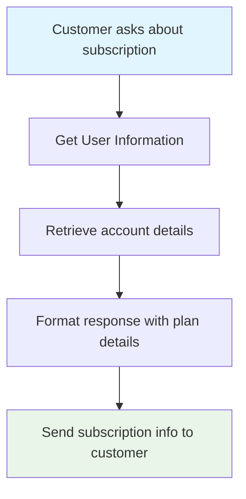
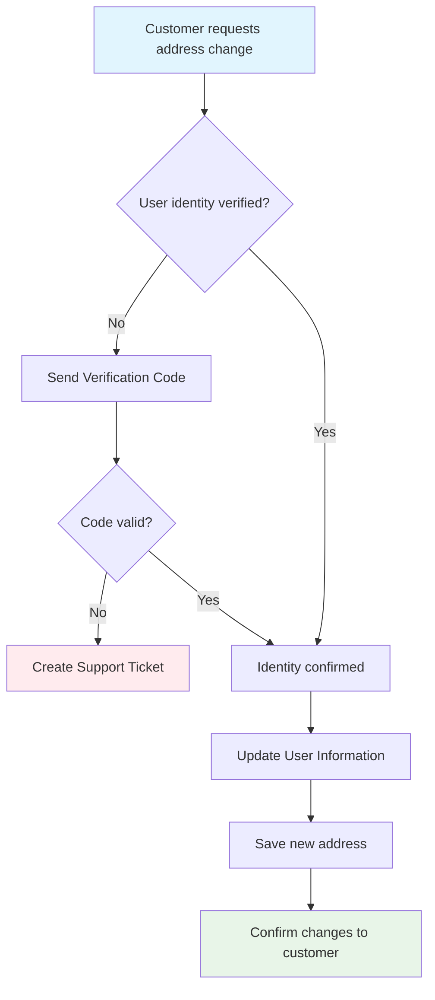
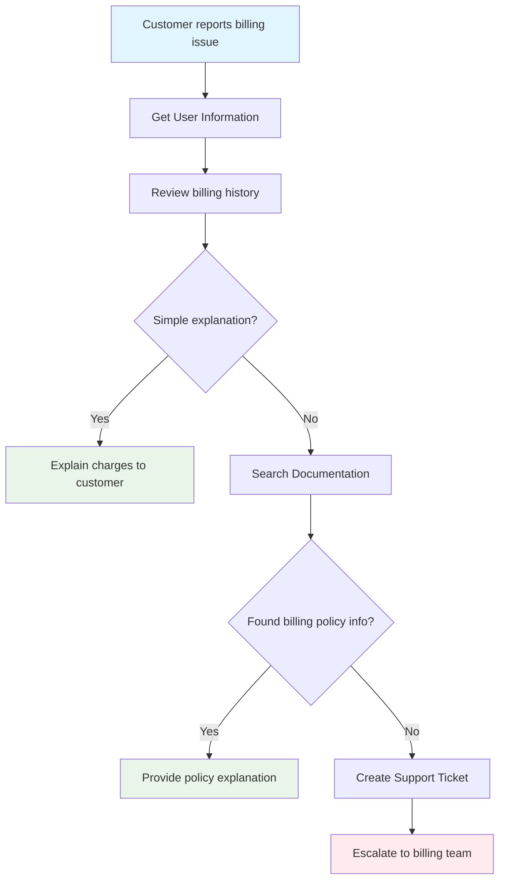
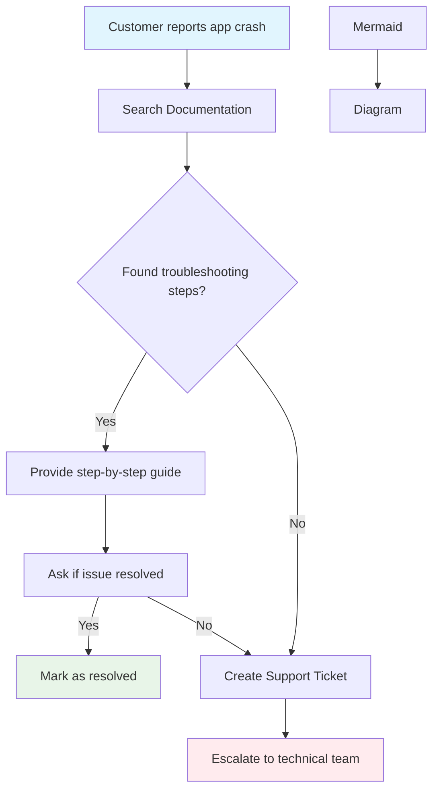

# Agents


#### **Not looking for Agents, and just want to connect to your favorite AI models, like ChatGPT?**

**Check out this resource instead:** [chatbots.md](../building-backend-features/chatbots.md "mention")



## Quick Summary

AI agents in Xano refer to autonomous entities designed to perform tasks by leveraging artificial intelligence. Your Xano Agents can integrate with your database, APIs, tasks, and functions, as well as external systems.

These agents can process data, make decisions, and execute actions without human intervention. AI agents in Xano can efficiently handle a variety of applications, from chatbots to data analysis tools, enhancing automation and productivity.


<table data-card-size="large" data-view="cards"><thead><tr><th></th><th data-hidden data-card-cover data-type="files"></th><th data-hidden data-card-target data-type="content-ref"></th></tr></thead><tbody><tr><td> <strong>Introduction to AI Agents</strong></td><td><a href="../.gitbook/assets/ai agents.png">ai agents.png</a></td><td></td></tr><tr><td> <strong>Tools for Agents &#x26; MCP Servers</strong></td><td><a href="../.gitbook/assets/ai tools.png">ai tools.png</a></td><td><a href="https://youtu.be/D1HtzC6yiO4">https://youtu.be/D1HtzC6yiO4</a></td></tr></tbody></table>



## What are Agents?

AI agents in Xano serve as integral components for building intelligent, automated systems as a part of your backend. These agents are designed to function autonomously, interacting with various elements of your app such as your APIs and database, as well as external systems, to streamline operations and enhance efficiency. AI agents can intelligently interpret inputs, process data, and deliver actionable outputs, all without the need for continuous human oversight.

Agents in Xano can leverage any of the most popular AI models once you provide an API key, such as:

* OpenAI
* Grok
* Anthropic / Claude
* Google Gemini

You can leverage the same visual builder you're used to using today to create workflows and functions that enable the agents to interact seamlessly with databases and external systems. With these foundational elements in place, AI agents can execute complex tasks, perform data analysis, or even serve as intelligent chatbots, making them versatile tools for a wide range of applications.

## Building Agents in Xano



### From the left-hand navigation, click AI, then <mark style="background-color:blue;">Agents</mark>&#x20;




### Click <mark style="background-color:blue;">+ Add Agent</mark>&#x20;




### Fill out the necessary information

<table><thead><tr><th width="173.0833740234375">Parameter Name</th><th>Purpose</th><th>Example</th></tr></thead><tbody><tr><td>Name</td><td>Give your agent a name that describes its role or primary function</td><td>Order Processing Agent</td></tr><tr><td>Description</td><td>Internal only field for describing what your agent does</td><td>Analyzes incoming orders, decides on fulfillment priority, and triggers shipping workflows</td></tr><tr><td>Agent Settings</td><td>Define dynamic inputs the Agent can accept from Function Stack workflows and reference environment variables</td><td>Configure placeholders with <code>{{ $args.propertyName }}</code> for workflow inputs, and <code>{{ $env.variableName }}</code> for environment variables</td></tr><tr><td>Model Host</td><td>Select the AI model host for the agent</td><td>Anthropic (Claude) OpenAI Google Gemini</td></tr><tr><td>Max Steps</td><td>Define how many steps the Agent can execute to complete its task.</td><td>5</td></tr><tr><td>System Prompt</td><td>The core instructions that define your Agent's role, capabilities, and behavior</td><td>You are a helpful AI Agent that completes tasks accurately. When you need additional information to complete a task, use the available tools. Never make assumptions.</td></tr><tr><td>Prompt</td><td>Additional context and instructions sent with each request</td><td>Please help the customer with their inquiry: {{ $args.customer_message }}. Their account ID is {{ $args.account_id }}.</td></tr><tr><td>Structured Outputs</td><td>Configure your Agent to return responses in a specific JSON format using structured outputs and your predefined schema</td><td>Checkbox to enable/disable</td></tr><tr><td>Output Schema</td><td>Define the JSON structure for structured outputs</td><td>text, user_email</td></tr><tr><td>Tags</td><td>Categories for organizing your Agents</td><td>contact, messaging</td></tr><tr><td>Request History</td><td>Controls logging of requests to<a data-mention href="../maintenance-monitoring-and-logging/request-history.md">request-history.md</a></td><td>
Inherit Settings: Uses workspace logging settings

Disabled: No logs recorded

Enabled: Logs requests with options for storage limits
</td></tr></tbody></table>




### Add some tools to your Agent

An Agent needs tools to function — the tools are essentially single functions that the Agent can perform, such as looking up user data or cancelling a subscription.





## Structured Outputs

Structured Outputs are used for providing a specific format that you need your agent to return its result as. This is especially useful when you are calling agents from other agents and want to ensure that the output from Agent 1 is clear and easy to understand for Agent 2.

You can add structured outputs to your Agent in the settings by checking the Structured Outputs checkbox, and then clicking <mark style="background-color:blue;">+ Add Output Schema</mark> to build your output schema.

<figure><figcaption></figcaption></figure>

## Example Agents

### :robot: Customer Support Agent

**Purpose**

This Agent is designed to handle customer inquiries that don't typically need human interaction.

**Tools**

An Agent designed for this purpose might have the following tools available:

* **Get User Information**
  * Retrieves user information from the database
* **Update User Information**
  * Retrieves existing user information from the database, and updates it per a user's request, such as changing their phone number or address
* **Send Verification Code**
  * This tool could be used as a secondary security measure to verify that the request is coming from the user that the data belongs to
* **Change Subscription**
  * Based on the user's request, this could be used to stop an upcoming renewal, or cancel a subscription immediately. Because Agents excel at 'fuzzy logic' depending on certain circumstances, this could also be used for things like churn prevention — dynamically offering the user a discount to stay, for example
* **Search Documentation**
  * Calls an external API from your chosen documentation platform to search your product documentation in an attempt to solve the user's query without human intervention
* **Create Support Ticket**
  * In the case that the Agent does not have the necessary tools to solve the user's concerns, create a support ticket for human intervention

### Agent Configuration

| Parameter Name     | Purpose                                                                                                      | Example                                                                                                                                                                                                                                                                                                                                         |
| ------------------ | ------------------------------------------------------------------------------------------------------------ | ----------------------------------------------------------------------------------------------------------------------------------------------------------------------------------------------------------------------------------------------------------------------------------------------------------------------------------------------- |
| Name               | Give your agent a name that describes its role or primary function                                           | Customer Support Agent                                                                                                                                                                                                                                                                                                                          |
| Description        | Internal only field for describing what your agent does                                                      | Handles customer inquiries that don't typically need human interaction. Can retrieve user information, update accounts, send verification codes, manage subscriptions, search documentation, and escalate to human support when needed.                                                                                                         |
| Agent Settings     | Define dynamic inputs the Agent can accept from Function Stack workflows and reference environment variables | `{{ $args.customer_message }}`, `{{ $args.user_id }}`, `{{ $args.ticket_priority }}`, `{{ $env.SUPPORT_API_KEY }}`                                                                                                                                                                                                                              |
| Model Host         | Select the AI model host for the agent                                                                       | Claude Sonnet 4                                                                                                                                                                                                                                                                                                                                 |
| Max Steps          | Define how many AI requests the Agent can execute to complete a task                                         | 8                                                                                                                                                                                                                                                                                                                                               |
| System Prompt      | The core instructions that define your Agent's role, capabilities, and behavior                              | You are a helpful Customer Support Agent that resolves customer inquiries efficiently. Always verify user identity before making account changes. Use available tools to gather information and resolve issues. If you cannot resolve an issue, create a support ticket for human intervention. Be polite, professional, and solution-oriented. |
| Prompt             | Additional context and instructions sent with each request                                                   | Customer inquiry: `{{ $args.customer_message }}`. User ID: `{{ $args.user_id }}`. Account status: `{{ $args.account_status }}`. Please help resolve this customer's issue while following security protocols.                                                                                                                                   |
| Structured Outputs | Configure your Agent to return responses in JSON format using structured outputs and your predefined schema  | ✅ Enabled                                                                                                                                                                                                                                                                                                                                       |
| Output Schema      | Define the JSON structure for agent responses                                                                | response\_message, action\_taken, ticket\_created, follow\_up\_required                                                                                                                                                                                                                                                                         |
| Tags               | Categories for organizing your Agents                                                                        | customer-service, support, automation                                                                                                                                                                                                                                                                                                           |
| Request History    | Controls logging of tool requests                                                                            | Enabled: Logs requests with options for storage limits                                                                                                                                                                                                                                                                                          |

### Example Interaction Flowcharts

#### 1. Account Information Request

_"What's my current subscription plan?"_

#### 2. Address Change Request

_"I need to update my shipping address"_

#### 3. Billing Question

_"Why was I charged twice this month?"_

#### 4. Technical Issue

_"The app keeps crashing on my phone"_

