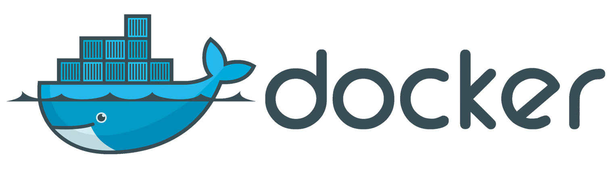

# Docker

<figure><figcaption></figcaption></figure>

Docker is a tool designed to make it easier to create, deploy, and run applications by using containers. Containers allow a developer to package up an application with all of the parts it needs, such as libraries and other dependencies, and ship it all out as one package.‌

Xano leverages Docker containers. Docker’s virtualization technology provides Xano the capability of running the components (PostgreSQL, PHP, Redis, etc.) in the same environment each and every time. This allows a consistent environment for development, testing, and production because the technology runs inside the Docker Engine instead of on the server.
